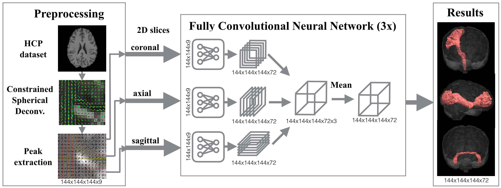

# TractSeg
 


Tool for fast and accurate white matter bundle segmentation from Diffusion MRI.

The tool works very good for HCP style data. For other MRI datasets it also works but results 
will have lower quality.

TractSeg is the code for the paper [Direct White Matter Bundle Segmentation using Stacked U-Nets](https://arxiv.org/abs/1703.02036) 
with further improvements (e.g. extract all bundles in one run). Please cite the paper if you use it. 


## Install
TractSeg only runs on Linux and OSX. It uses Python 2.

#### Install Prerequisites
* [Pytorch](http://pytorch.org/) (if you do not have a GPU, install Pytorch via conda as this is fastest on CPU)
* [Mrtrix 3](http://mrtrix.readthedocs.io/en/latest/installation/linux_install.html)
* [FSL](https://fsl.fmrib.ox.ac.uk/fsl/fslwiki/FslInstallation) (if you already have a brain mask this is not needed)
* BatchGenerators: `pip install https://github.com/MIC-DKFZ/batchgenerators/archive/tractseg_stable.zip`

#### Install TractSeg
Latest stable version:
```
pip install https://github.com/MIC-DKFZ/TractSeg/archive/v1.1.zip
```

## Usage

#### Simple example:
To segment the bundles on a Diffusion Nifti image run the following command. 
You can use the example image provided in this repository under `examples`.  
```
TractSeg -i Diffusion.nii.gz    # expects Diffusion.bvals and Diffusion.bvecs to be in the same directory
```
This will create a folder `tractseg_ouput` inside of the same directory as your input file. 
This folder contains `bundle_segmentations.nii.gz` which is a 4D Nifti image (`[x,y,z,bundle]`). 
The fourth dimension contains the binary bundle segmentations. 

#### Custom input and output path:
```
TractSeg -i my/path/my_diffusion_image.nii.gz
         -o my/output/directory
         --bvals my/other/path/my.bvals
         --bvecs yet/another/path/my.bvecs
         --output_multiple_files
```

#### Use existing peaks
```
TractSeg -i my/path/my_mrtrix_csd_peaks.nii.gz --skip_peak_extraction
```

#### Bundle names
The following list shows the index of 
each extracted bundle in the output file.
```
0: Background
1: AF_left         (Arcuate fascicle)
2: AF_right
3: ATR_left        (Anterior Thalamic Radiation)
4: ATR_right
5: CA              (Commissure Anterior)
6: CC_1            (Rostrum)
7: CC_2            (Genu)
8: CC_3            (Rostral body (Premotor))
9: CC_4            (Anterior midbody (Primary Motor))
10: CC_5           (Posterior midbody (Primary Somatosensory))
11: CC_6           (Isthmus)
12: CC_7           (Splenium)
13: CG_left        (Cingulum left)
14: CG_right   
15: CST_left       (Corticospinal tract
16: CST_right 
17: MLF_left       (Middle longitudinal fascicle)
18: MLF_right
19: FPT_left       (Fronto-pontine tract)
20: FPT_right 
21: FX_left        (Fornix)
22: FX_right
23: ICP_left       (Inferior cerebellar peduncle)
24: ICP_right 
25: IFO_left       (Inferior occipito-frontal fascicle) 
26: IFO_right
27: ILF_left       (Inferior longitudinal fascicle) 
28: ILF_right 
29: MCP            (Middle cerebellar peduncle)
30: OR_left        (Optic radiation) 
31: OR_right
32: POPT_left      (Parieto‐occipital pontine)
33: POPT_right 
34: SCP_left       (Superior cerebellar peduncle)
35: SCP_right 
36: SLF_I_left     (Superior longitudinal fascicle I)
37: SLF_I_right 
38: SLF_II_left    (Superior longitudinal fascicle II)
39: SLF_II_right
40: SLF_III_left   (Superior longitudinal fascicle III)
41: SLF_III_right 
42: STR_left       (Superior Thalamic Radiation)
43: STR_right 
44: UF_left        (Uncinate fascicle) 
45: UF_right 
46: CC             (Corpus Callosum - all)
47: T_PREF_left    (Thalamo-prefrontal)
48: T_PREF_right 
49: T_PREM_left    (Thalamo-premotor)
50: T_PREM_right 
51: T_PREC_left    (Thalamo-precentral)
52: T_PREC_right 
53: T_POSTC_left   (Thalamo-postcentral)
54: T_POSTC_right 
55: T_PAR_left     (Thalamo-parietal)
56: T_PAR_right 
57: T_OCC_left     (Thalamo-occipital)
58: T_OCC_right 
59: ST_FO_left     (Striato-fronto-orbital)
60: ST_FO_right 
61: ST_PREF_left   (Striato-prefrontal)
62: ST_PREF_right 
63: ST_PREM_left   (Striato-premotor)
64: ST_PREM_right 
65: ST_PREC_left   (Striato-precentral)
66: ST_PREC_right 
67: ST_POSTC_left  (Striato-postcentral)
68: ST_POSTC_right
69: ST_PAR_left    (Striato-parietal)
70: ST_PAR_right 
71: ST_OCC_left    (Striato-occipital)
72: ST_OCC_right
```


#### Advanced Options
Run `TractSeg --help` for more advanced options. For example you can specify your own `brain_mask`,
`bvals` and `bvecs`.

If you have multi-shell data and you do not need super fast runtime use `--csd_type csd_msmt_5tt` for slightly better results.


## FAQ
**My output segmentation does not look like any bundle at all!**

The input image must have the same "orientation" as the Human Connectome Project data (LEFT must be 
on the same side as LEFT of the HCP data). If the image 
orientation and the gradient orientation of your data is the same as in `examples/Diffusion.nii.gz`
you are fine. If your image has different orientation you can use the flag `--flip`. This will use a 
model that was trained with mirroring data augmentation. So it works with any orientation. 
But it has slightly worse results (about 1 dice point less).
If it is still not working your gradients probably have the wrong orientation. You have to manually 
flip the sign of your gradients. 


**Did I install the prerequisites correctly?**

You can check if you installed Mrtrix correctly if you can run the following command on your terminal:
`dwi2response -help`

You can check if you installed FSL correctly if you can run the following command on your terminal: 
`bet -help`

TractSeg uses these commands so they have to be available.

**My image does not contain any b=1000mm/s^2 values.**

Use `--csd_type csd_msmt` or `--csd_type csd_msmt_5tt`. Those work for any b-value.


## Train your own model
TractSeg uses a pretrained model. However, you can also train your own model on your own data.
But be aware: This is more complicated than just running with the pretrained model. The following 
guide is quite short and you might have problems following every step. Contact the author if
you need help training your own model.

1. The folder structure of your training data should be the following:
```
custom_path/HCP/subject_01/
      '-> 270g_125mm_peaks.nii.gz   (mrtrix CSD peaks;  shape: [x,y,z,9])
      '-> bundle_masks.nii.gz       (Reference bundle masks; shape: [x,y,z,nr_bundles])
custom_path/HCP/subject_02/
      ...
```
2. Create a file `~/.tractseg/config.txt`. This contains the path to your data directory, e.g.
`working_dir=custom_path`.
3. Adapt `tractseg.libs.DatasetUtils.scale_input_to_unet_shape()` to scale your input data to the 
UNet input size of `144x144`. This is not very convenient. Contact the author if you need help.
4. Adapt `tractseg.libs.ExpUtils.get_bundle_names()` with the bundles you use in your reference data.
4. Adapt `tractseg.libs.Subjects` with the list of your subject IDs.
5. Run `ExpRunner --en my_experiment_name` 
6. `custom_path/hcp_exp/my_experiment_name` contains the results

