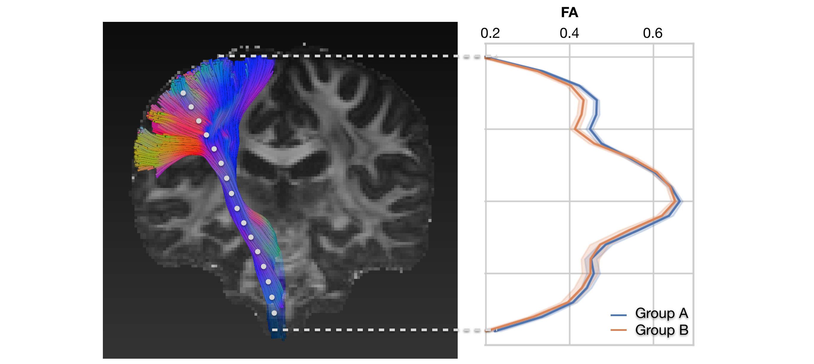

# Tractometry

Measuring the FA (or MD or other values) along tracts can provide valuable insights (e.g. [Yeatman et al. 2012](https://journals.plos.org/plosone/article?id=10.1371/journal.pone.0049790)).

TractSeg provides an easy way to do so by following these steps (latest `master` branch needed):
1. Go to the folder where you have your `Diffusion.nii.gz`, `Diffusion.bvals`, `Diffusion.bvecs` and `FA.nii.gz` files. They should rigidly be aligned to MNI space, if not add the option `--preprocess` in step 2 and `Diffusion.nii.gz` will automatically be rigidly registered to MNI space (but not `FA.nii.gz`. You have to take care of that).
2. Create segmentation of bundles:  
`TractSeg -i Diffusion.nii.gz --output_type tract_segmentation --output_multiple_files --keep_intermediate_files` (runtime on GPU: 2min ~14s)  
(**Note**: if you already have the MRtrix CSD peaks you can also pass those as input and add the option `--skip_peak_extraction` which is faster)
3. Create segmentation of start and end regions of bundles:  
`TractSeg -i tractseg_output/peaks.nii.gz -o . --skip_peak_extraction --output_type endings_segmentation --output_multiple_files --keep_intermediate_files` (runtime on GPU: ~42s)
4. Create Tract Orientation Maps and use them to do bundle-specific tracking:  
`TractSeg -i tractseg_output/peaks.nii.gz -o . --skip_peak_extraction --output_type TOM --output_multiple_files --keep_intermediate_files --track --filter_tracking_by_endpoints` (runtime on GPU: ~3min 34s)  
(**Note**: `--filter_tracking_by_endpoints` only keeps those fibers starting and ending in the regions segmented in step 2 and 3. On low resolution datasets the results from
 step 2 and 3 might not be so good and subsequently the resulting tractograms are sometimes very sparse or empty. If that is the case manually check the results of the
 previous steps.)
5. Run tractometry:  
`cd tractseg_output`
`Tractometry -i TOM_trackings/ -o Tractometry_subject1.csv -e endings_segmentations/ -s ../FA.nii.gz` (runtime on CPU: ~20s)  
Tractometry will evaluate the FA along 20 equality distant points along each streamline. Finally it will take the mean for each of those 20 points over all streamlines.
6. Repeat step 1-4 for every subject (use a shell script for that)
7. Plot the results with [this python code](https://github.com/MIC-DKFZ/TractSeg/blob/master/examples/plot_tractometry_results.ipynb)

### Further options   
Instead of analysing the FA along the tracts you can also analyze the peak length along the tracts. This has one major advantage: The peaks are generated using Constrained Spherical Deconvolution (CSD) which can handle crossing fibers in contrast to FA which can not. How does TractSeg analyze the peak length along a certain tract:
CSD gives us up to three peaks per voxel (all further ones are discarded). Now TractSeg selects the peak which is most similar to the direction of the bundle at that voxel (= peak with the lowest angular error to the peak from the Tract Orientation Map for that bundle). The length of that peak is then analyzed.  
`Tractometry -i TOM_trackings/ -o Tractometry_subject1.csv -e endings_segmentations/ -s peaks.nii.gz --TOM TOM --peak_length`