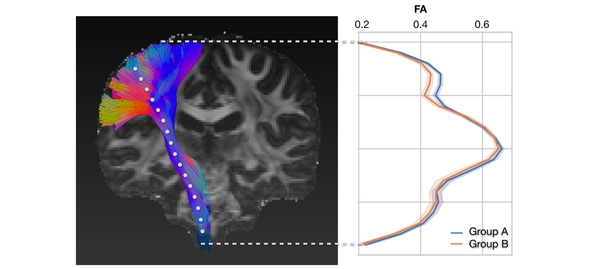

# Tractometry

> Warning: This code was not tested extensively and we did not use it in any paper yet. Therefore use with care.

Measuring the FA (or MD or other values) along tracts can provide valuable insights (e.g. [Yeatman et al. 2012](https://journals.plos.org/plosone/article?id=10.1371/journal.pone.0049790)).

TractSeg provides an easy way to do so by following these steps (version >=`1.6` needed):
1. Go to the folder where you have your `Diffusion.nii.gz`, `Diffusion.bvals`, `Diffusion.bvecs` and `FA.nii.gz` files. 
They should rigidly be aligned to [MNI space](https://github.com/MIC-DKFZ/TractSeg#aligning-image-to-mni-space).
2. Create segmentation of bundles:  
`TractSeg -i Diffusion.nii.gz -o tractseg_output --raw_diffusion_input --output_type tract_segmentation` (runtime on 
GPU: 2min ~14s)  
(**Note**: if you already have the MRtrix CSD peaks you can also pass those as input and remove the option `--raw_diffusion_input`)
3. Create segmentation of start and end regions of bundles:  
`TractSeg -i tractseg_output/peaks.nii.gz -o tractseg_output --output_type endings_segmentation` (runtime on GPU: ~42s)
4. Create Tract Orientation Maps and use them to do bundle-specific tracking:  
`TractSeg -i tractseg_output/peaks.nii.gz -o tractseg_output --output_type TOM` (runtime on GPU: ~1min 30s)
`Tracking -i tractseg_output/peaks.nii.gz -o tractseg_output` (runtime on CPU: ~5min)    
 **Note**: Per default 2000 streamlines will be created per bundle. Using `--nr_fibers N` a different number can be chosen. 
 If longer runtime is ok, it is advisable to choose a higher number like 6000 or 10000. As the streamline seeding is random, 
 results will be slightly different everytime you run it. If you only choose 2000 streamlines, the results you will get for 
 the tractometry can vary up to 0.03 difference in FA just between 2 runs. If you choose 10000 this will go down to around
 0.004 which is more acceptable.
5. Run tractometry:  
`cd tractseg_output`  
`Tractometry -i TOM_trackings/ -o Tractometry_subject1.csv -e endings_segmentations/ -s ../FA.nii.gz` (runtime on CPU: ~20s)  
Tractometry will evaluate the FA along 20 equality distant points along each streamline. Finally it will take the mean for each of those 20 points over all streamlines.
6. Repeat step 1-4 for every subject (use a shell script for that)
7. Plot the results with [this python code](../examples/plot_tractometry_results.ipynb)

### Further options   
Instead of analysing the FA along the tracts you can also analyze the peak length along the tracts. This has one major advantage: The peaks are generated using Constrained Spherical Deconvolution (CSD) which can handle crossing fibers in contrast to FA which can not. How does TractSeg analyze the peak length along a certain tract:
CSD gives us up to three peaks per voxel (all further ones are discarded). Now TractSeg selects the peak which is most similar to the direction of the bundle at that voxel (= peak with the lowest angular error to the peak from the Tract Orientation Map for that bundle). The length of that peak is then analyzed.  
`Tractometry -i TOM_trackings/ -o Tractometry_subject1.csv -e endings_segmentations/ -s peaks.nii.gz --TOM TOM --peak_length`