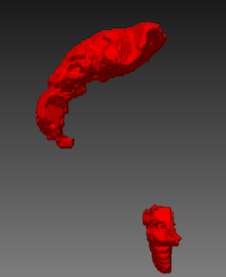

# Tutorial

This tutorial shows best practices for how to you use TractSeg for 1. HCP-like data and 2. non-HCP data.  


## 1. HCP (Human Connectome Project) or similar data

If you want to use TractSeg for data from the original Human Connectome Project or for data that was acquired similarly 
(resolution <1.5mm, high number of orientations, good preprocessing, ...) like for example the HCP Lifespan project, TractSeg 
will normally work quite well as it was trained on HCP data. 

In your folder you should have the following files: `Diffusion.nii.gz`, `Diffusion.bvals`, `Diffusion.bvecs`, `nodif_brain_mask.nii.gz`,
`T1w_acpc_dc_restore_brain.nii.gz`. For HCP data they are normally already in MNI space. Now you can run TractSeg:
```
TractSeg -i Diffusion.nii.gz --raw_diffusion_input --csd_type csd_msmt_5tt --brain_mask nodif_brain_mask.nii.gz
```
* `--raw_diffusion_input`: This tells the program that we input a Diffusion image and not a peak image (which would be expected by default). 
It will internally run CSD (Constrained Spherical Deconvolution) and extract the 3 main fiber peaks.  
* `--csd_type csd_msmt_5tt`: If we do not specify the CSD type TractSeg will use the standard MRtrix CSD. But for HCP data we can make use of
the multiple b-value shells and the properly registered T1 image to run a more sophisticated CSD model giving slightly better results.
NOTE: This expects the T1 image to be in the same folder as the Diffusion.nii.gz image and have the name `T1w_acpc_dc_restore_brain.nii.gz`.
`csd_msmt_5tt` is also quite slow. You can use `csd` if you want more speed at the cost of slightly worse results.  
* You can use the options `--bvals` and `--bvecs` if your bvals and bvecs file use a different naming convention.  
* If you have a NVIDIA GPU and CUDA installed TractSeg will run in less than 1min. Otherwise it will fall back to CPU and run several minutes.
* The output is a directory `tractseg_output` containing the file `peaks.nii.gz` and a subdirectory `bundle_segmentations` containing one 
binary nifti image for each segmented bundle.  
* results for right CST (corticospinal tract):  


Now we have binary tract segmentations but TractSeg can also segment the start and end regions of those bundles and generate Tract Orientation
Maps (TOM) which can be used to generated bundle-specific tractograms:

```
TractSeg -i tractseg_output/peaks.nii.gz -o . --output_type endings_segmentation
```
* This will add another subdirectory `endings_segmentations` containing the beginning region (`_b`) and ending region (`_e`) of each bundle.
* results for right CST (corticospinal tract):  


```
TractSeg -i tractseg_output/peaks.nii.gz -o . --output_type TOM --track --filter_tracking_by_endpoints
```
* This will add another subdirectory `TOM` containing the Tract Orientation Maps.  
* `--track`: This will automatically run MRtrix FACT tracking on the TOM peaks.  
* `--filter_tracking_by_endpoints`: Only keeps those fibers starting and ending in the beginnings and endings regions (plus a small margin).  
* You can add the option `--tracking_format tck` to generate tck instead of trk files.
* Peaks and streamlines can be visualized using for example [MITK Diffusion](http://mitk.org/wiki/DiffusionImaging#Downloads).
(NOTE: Peaks have to be flipped along the z-axis to be displayed correctly in MITK.)  
* results for right CST (corticospinal tract):  


## 2. non-HCP data

Most diffusion dataset have lower resolution than HCP data (2-2.5mm) and only one b-value with only a small number of orientations (e.g. 32).
Because of the reduced image quality the results of TractSeg will also suffer to a certain degree. But using the right options TractSeg can still
produce good results for most datasets.

In your folder you should have the following files: `Diffusion.nii.gz`, `Diffusion.bvals`, `Diffusion.bvecs`. They should rigidly be aligned to
MNI space. You can either do so [manually](https://github.com/MIC-DKFZ/TractSeg#aligning-image-to-mni-space) or 
have TractSeg do it by adding the option `--preprocess`. 
```
TractSeg -i Diffusion.nii.gz --raw_diffusion_input --bundle_specific_threshold --postprocess
```
* The brain mask will be extracted automatically using FSL. The standard MRtrix CSD will be used for extracting the peaks because this also works if 
only one b-value shell is available.  
* `--bundle_specific_threshold`: Lowering the threshold for converting the model output to binary segmentations. Instead of
0.5 use 0.3 for CA and 0.4 for CST and FX. For all other bundles keep 0.5. This will increase sensitivity for those
difficult bundles and improve results on low resolution data.  
* `--postprocess`: This will fill small holes in the segmentation and remove small blobs not connected to the rest of the
segmentation.  
* You can also try the option `--super_resolution`. Per default the input image is upsampled to 1.25mm resolution (the resolution TractSeg was trained on) and 
finally downsampled back to the original resolution. Using `--super_resolution` will output the image at 1.25mm. Especially if image resolution 
is low parts of the CA can get lost during downsampling.

Now segmentation of the bundle endings works straight forward: 
```
TractSeg -i tractseg_output/peaks.nii.gz -o . --output_type endings_segmentation
```

For the extraction of the Tract Orientation maps we can again add the option `--bundle_specific_threshold`:
```
TractSeg -i tractseg_output/peaks.nii.gz -o . --output_type TOM --bundle_specific_threshold --track
```
* You can also add the option `--filter_tracking_by_endpoints`. However, that should only be used with care on non-HCP data. On non-HCP data 
the results can have flaws for some bundles. This can lead to major problems for the option `--filter_tracking_by_endpoints` as 
this is very dependend on the endings segmentations, bundle segmentations and trackings to all fit well together. If one of them is flawed, the
resulting tractogram can be very sparse.