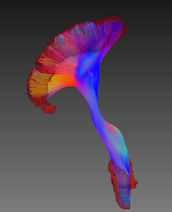

# Tutorial

This tutorial shows best practices for how to you use TractSeg for 1. HCP-like data and 2. non-HCP data.  


## 1. HCP (Human Connectome Project) or similar data

If you want to use TractSeg for data from the original Human Connectome Project or for data that was acquired similarly 
(resolution <1.5mm, high number of orientations, good preprocessing, ...) like for example the HCP Lifespan project, TractSeg 
will normally work quite well as it was trained on HCP data. 

In your folder you should have the following files: `Diffusion.nii.gz`, `Diffusion.bvals`, `Diffusion.bvecs`, `nodif_brain_mask.nii.gz`,
`T1w_acpc_dc_restore_brain.nii.gz`. For HCP data they are normally already in MNI space. Now you can run TractSeg:
```
TractSeg -i Diffusion.nii.gz -o tractseg_output --raw_diffusion_input --csd_type csd_msmt_5tt --brain_mask nodif_brain_mask.nii.gz
```
* `--raw_diffusion_input`: This tells the program that we input a Diffusion image and not a peak image (which would be expected by default). 
It will internally run CSD (Constrained Spherical Deconvolution) and extract the 3 main fiber peaks.  
* `--csd_type csd_msmt_5tt`: If we do not specify the CSD type TractSeg will use the standard MRtrix CSD. But for HCP data we can make use of
the multiple b-value shells and the properly registered T1 image to run a more sophisticated CSD model giving slightly better results.
NOTE: This expects the T1 image to be in the same folder as the Diffusion.nii.gz image and have the name 
`T1w_acpc_dc_restore_brain.nii.gz`. The T1 image must have all non-brain area removed.
`csd_msmt_5tt` is also quite slow. You can use `csd` if you want more speed at the cost of slightly worse results.  
* You can use the options `--bvals` and `--bvecs` if your bvals and bvecs file use a different naming convention.  
* If you have a NVIDIA GPU and CUDA installed TractSeg will run in less than 1min. Otherwise it will fall back to CPU and run several minutes.
* The output is a directory `tractseg_output` containing the file `peaks.nii.gz` and a subdirectory `bundle_segmentations` containing one 
binary nifti image for each segmented bundle.  
* results for right CST (corticospinal tract):  


Now we have binary tract segmentations but TractSeg can also segment the start and end regions of those bundles and generate Tract Orientation
Maps (TOM) which can be used to generated bundle-specific tractograms:

```
TractSeg -i tractseg_output/peaks.nii.gz -o tractseg_output --output_type endings_segmentation
```
* This will add another subdirectory `endings_segmentations` containing the beginning region (`_b`) and ending region (`_e`) of each bundle.
* results for right CST (corticospinal tract):  


```
TractSeg -i tractseg_output/peaks.nii.gz -o tractseg_output --output_type TOM
```
* This will add another subdirectory `TOM` containing the Tract Orientation Maps (TOMs).  
```
Tracking -i tractseg_output/peaks.nii.gz -o tractseg_output
```
* This will run tracking on the TOMs. The tracking algorithm places a gaussian distribution with fixed standard
deviation on each peak. Then FACT tracking is run but the orientation is sampled from the gaussian distribution. This
way it is more like probabilistic tracking, giving more complete results.  
* Only keeps those fibers starting and ending in the beginnings and endings regions.  
* You can add the option `--tracking_format tck` to generate tck instead of trk files.
* Peaks and streamlines can be visualized using for example [MITK Diffusion](http://mitk.org/wiki/DiffusionImaging#Downloads).
(NOTE: Peaks have to be flipped along the z-axis to be displayed correctly in MITK.)
* results for right CST (corticospinal tract):  


## 2. non-HCP data

Most diffusion dataset have lower resolution than HCP data (2-2.5mm) and only one b-value with only a small number of orientations (e.g. 32).
Because of the reduced image quality the results of TractSeg will also suffer to a certain degree. But using the right options TractSeg can still
produce good results for most datasets.

In your folder you should have the following files: `Diffusion.nii.gz`, `Diffusion.bvals`, `Diffusion.bvecs`. They should rigidly be aligned to
MNI space (and have isotropic spacing). See [here](https://github.com/MIC-DKFZ/TractSeg#aligning-image-to-mni-space) for how to do this. 
```
TractSeg -i Diffusion.nii.gz -o tractseg_output --raw_diffusion_input 
```
* The brain mask will be extracted automatically using FSL. The standard MRtrix CSD will be used for extracting the peaks because this also works if 
only one b-value shell is available.  
* The CA and FX bundle are quite thin and therefore tend to be incomplete on low resolution data. TractSeg 
automatically checks for these two bundles if they are incomplete (if there are several segmented blobs instead of 
only one big one) and if they are incomplete uses a lower threshold (instead of the default of 0.5) to convert the 
probability maps (which are the output of the network) to binary masks. This way sensitivity is increased. Moreover, 
hole closing with a size of 6 voxels is used which also helps to connect disconnected blobs. NOTE: These postprocessing
steps are only done for the CA and FX and only if they are incomplete.
* Per default a simple postprocessing is also activated for all bundles: Blobs with are made up of only a few voxels 
are removed. You can deactivate this option by using `--no_postprocess`.
* You can also try the option `--super_resolution`. Per default the input image is upsampled to 1.25mm resolution 
(the resolution TractSeg was trained on) and finally downsampled back to the original resolution. 
Using `--super_resolution` will output the image at 1.25mm. Especially if image resolution is low parts of the CA can 
get lost during downsampling.

> Note: If you use `--super_resolution` you have to use it for all steps (tract_segmentation, 
endings_segmentation and TOM). Otherwise tracking is not possible as the masks do not have the same
dimensions.

Now segmentation of the bundle endings works straight forward: 
```
TractSeg -i tractseg_output/peaks.nii.gz -o tractseg_output --output_type endings_segmentation
```

The extraction of the Tract Orientation Maps is also straight forward:
```
TractSeg -i tractseg_output/peaks.nii.gz -o tractseg_output --output_type TOM
```

Now we can run the tracking:
```
Tracking -i tractseg_output/peaks.nii.gz -o tractseg_output
```
